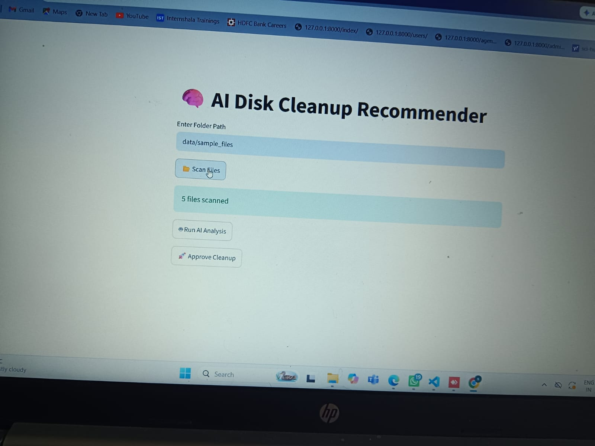
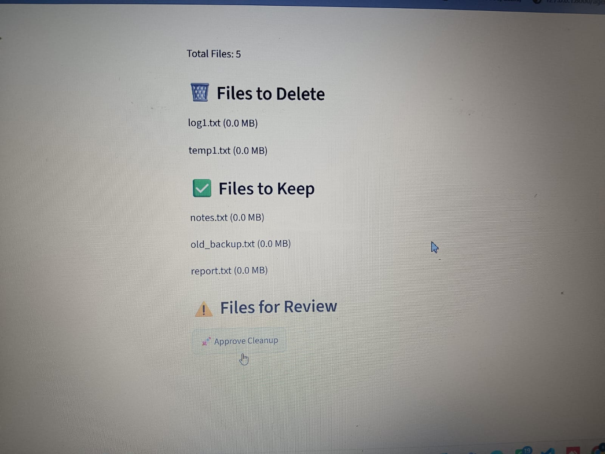
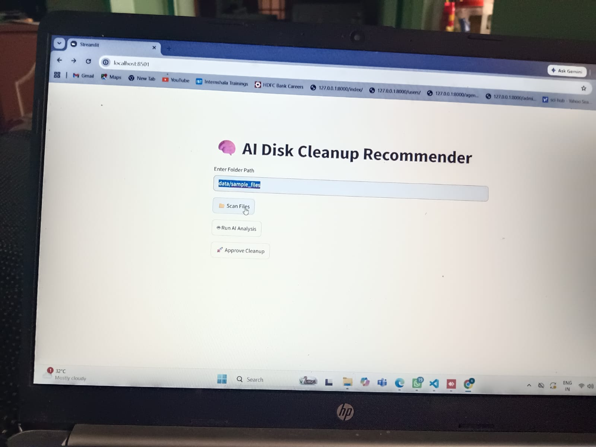
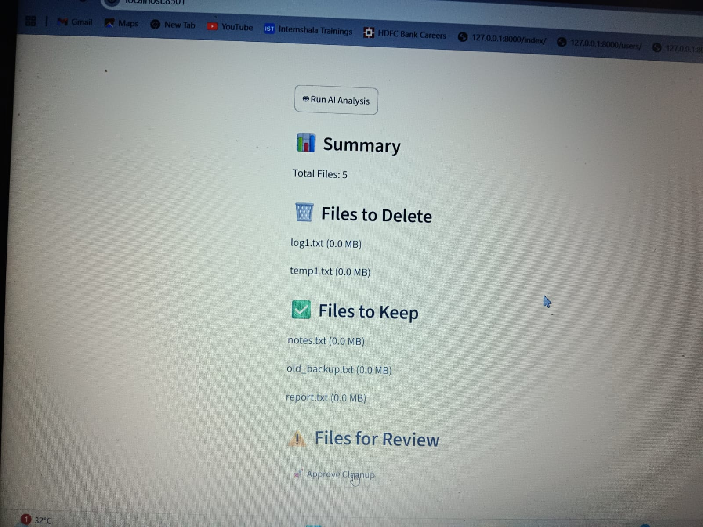

# AI Disk Cleanup Recommender

## 1. Project Title and Problem Statement

### Project Title

**AI Disk Cleanup Recommender**

### Problem Statement

Modern computer systems accumulate temporary files, log files, cache files, and other unnecessary data over time. These files consume valuable disk space and may impact system performance. Manually identifying such files is time-consuming and error-prone.

The AI Disk Cleanup Recommender analyzes files and folders, identifies potentially unnecessary files based on predefined rules, and provides intelligent recommendations to help users optimize storage usage efficiently.

---

## 2. Team Members

| Name                      | Role                     |
| ------------------------- | ------------------------ |
| G.Harsitha | Project Lead | Developer                |
| G.Varshitha               | AI integration           |
| G.Vyshnavi                | Tester                   |
| G.Gouri                   | Documentation & Reporting|

---

## 3. Features Implemented

* Directory scanning and analysis
* Detection of temporary files
* Detection of log files
* Large file identification
* Storage usage calculation
* AI-based cleanup recommendations
* Interactive Streamlit dashboard
* File categorization
* Summary statistics and insights

---

## 4. Architecture Overview

```text
User
  │
  ▼
Streamlit Web Interface
  │
  ▼
File Scanner Module
  │
  ├── Temporary File Detection
  ├── Log File Detection
  ├── Large File Analysis
  └── Storage Statistics
  │
  ▼
AI Recommendation Engine
  │
  ▼
Cleanup Suggestions Dashboard
```

### Workflow

1. User selects a folder.
2. System scans all files recursively.
3. Files are categorized.
4. AI recommendation engine evaluates cleanup opportunities.
5. Recommendations are displayed on the dashboard.

---

## 5. Tools and Technologies Used

### Programming Language

* Python

### Framework

* Streamlit

### Libraries

* os
* pathlib
* pandas
* numpy

### Development Tools

* Visual Studio Code
* Git
* GitHub

### Operating System

* Windows 10 / Windows 11

---

## 6. Setup Instructions

### Clone Repository

```bash
git clone https://github.com/harsithagali/AI_Disk_Cleanup_Recommender.git
```

### Navigate to Project Directory

```bash
cd AI_Disk_Cleanup_Recommender
```

### Create Virtual Environment

```bash
python -m venv venv
```

### Activate Environment

```bash
venv\Scripts\activate
```

### Install Dependencies

```bash
pip install -r requirements.txt
```

---

## 7. Run Instructions

Run the application using:

```bash
python -m streamlit run app.py
```

The application will automatically open in your browser.

Default URL:

```text
http://localhost:8501
```

---

## 8. Screenshots

<h3 align="center">🏠 Home Page</h3>

<p align="center">
  
</p>

<p align="center">
Application landing page showing project overview and folder selection.
</p>

---

<h3 align="center">📂 Folder Selection</h3>

<p align="center">
  
</p>

<p align="center">
User selects a directory to analyze.
</p>

---

<h3 align="center">📊 Disk Analysis Results</h3>

<p align="center">
  
</p>

<p align="center">
Display of scanned files, storage statistics, and categorized files.
</p>

---

<h3 align="center">🤖 AI Cleanup Recommendations</h3>

<p align="center">
  
</p>

<p align="center">
AI-generated recommendations for temporary files, log files, and large files.
</p>

---

## 9. Sample Input and Sample Output

### Sample Input

Folder Selected:

```text
C:\Users\Demo\Downloads
```

Files Found:

```text
temp1.txt
temp_data.tmp
log1.txt
video.mp4
project.zip
```

### Sample Output

```text
Analysis Completed

Total Files: 5
Temporary Files: 2
Log Files: 1
Large Files: 1

Recommendations:

✓ Delete temp1.txt
✓ Delete temp_data.tmp
✓ Review log1.txt
✓ Consider moving video.mp4 to external storage
```

---

## 10. AI Capability Demonstrated

The application demonstrates AI-inspired decision-making through:

* File pattern recognition
* File categorization
* Automated recommendation generation
* Storage impact analysis
* Intelligent cleanup suggestions

### Example

```text
File: temp_data.tmp
Reason: Temporary file detected
Recommendation: Safe to delete

File: log1.txt
Reason: Log file detected
Recommendation: Review before deletion
```

---

## 11. Assumptions and Limitations

### Assumptions

* User has permission to access selected folders.
* File extensions accurately represent file types.
* Users review recommendations before deleting files.

### Limitations

* Does not automatically delete files.
* Rule-based recommendation engine.
* Duplicate file detection not implemented.
* Does not analyze file content.
* Performance depends on folder size.

---

## 12. Demo Video Link

Demo Video:

```text
https://your-demo-video-link-here.com
```

Replace the above link with your actual YouTube, Google Drive, or Loom video URL.

---

## 13. Future Enhancements

* Duplicate file detection
* File age analysis
* Automated cleanup actions
* PDF report generation
* Cloud storage analysis
* Machine Learning-based recommendation engine

---

## 14. Project Structure

```text
AI_Disk_Cleanup_Recommender/
│
├── app.py
├── README.md
├── requirements.txt
├── home.jpeg
├── folder_selection.jpeg
├── analysis_results.jpeg
├── recommendations.jpeg
└── assets/
```

---

## 15. Project Outcome

The AI Disk Cleanup Recommender successfully analyzes disk usage, identifies unnecessary files, and provides intelligent cleanup recommendations through an interactive Streamlit dashboard. The project demonstrates practical application of Python, file system analysis, and AI-inspired recommendation techniques for storage optimization.

--


GitHub Repository:
https://github.com/harsithagali/AI_Disk_Cleanup_Recommender

---

